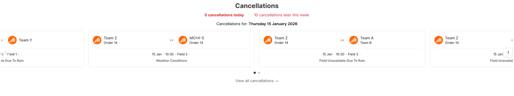
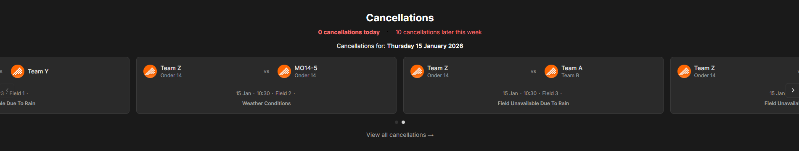

# Cancelled Matches Carousel Widget

A responsive carousel widget that displays cancelled hockey matches with support for both light and dark modes.

## Features

- **Carousel Navigation**: Smooth scrolling through cancelled matches
- **Dark Mode Support**: Toggle between light and dark themes
- **Responsive Design**: Works on desktop and mobile devices
- **Real-time Data**: Fetches match data from API
- **Date Filtering**: Shows cancellations for specific dates
- **Match Details**: Displays team names, times, locations, and cancellation reasons

## Screenshots

### Light Mode


### Dark Mode


## Configuration

The widget can be configured through the `dummyData.js` file:

```javascript
config: {
  dark_mode: false, // Set to true for dark mode
  view_all_cancellations_link: { href: "https://example.com" },
  hide_widget_title: false,
  api_token: "your-api-token",
  api_url: "your-api-url"
}
```

## Files

- `index.html` - Main HTML structure
- `main.js` - Core functionality (1,159 lines)
- `style.css` - Styling with dark mode support (471 lines)
- `dummyData.js` - Configuration and sample data
- `screenshots/` - Widget screenshots (light and dark mode)

## Usage

1. Open `index.html` in a browser
2. Or use a local server:
   ```bash
   python -m http.server 8000
   # Navigate to http://localhost:8000/widgets/js-cancelled-matches-carousel-widget/
   ```

## Technical Details

- **Vanilla JavaScript** (ES6+ modules)
- **jQuery** for AJAX requests
- **CSS Grid & Flexbox** for layout
- **Smooth scrolling** carousel implementation
- **Dark mode** via CSS class toggling

