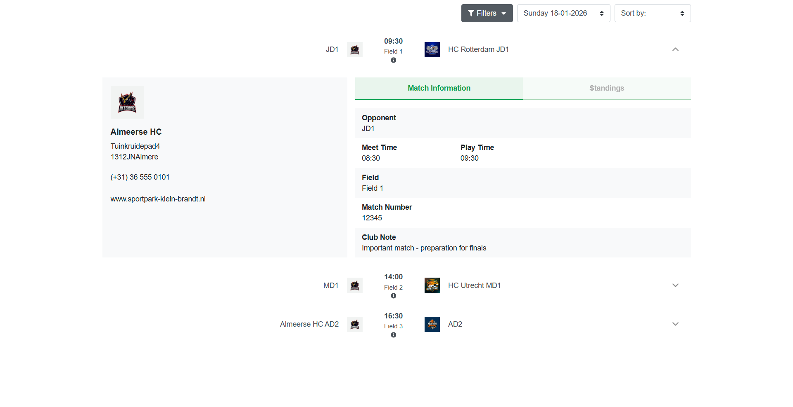

# Hockey Matches Schedule Widget

A comprehensive, interactive widget for displaying and managing hockey match schedules with advanced filtering, date navigation, and detailed match information.

## Overview

The Hockey Matches Schedule Widget is a vanilla JavaScript-based component designed to provide users with an intuitive interface to browse, filter, and view detailed information about upcoming hockey matches. Built with modern web standards and Bootstrap styling, it offers seamless user experience across all devices.

## 📸 Screenshots



_The widget displaying match schedule with filtering options, date navigation, and accordion match details._

## Features

### 📅 **Date Navigation**

- Interactive date dropdown selector for browsing matches across multiple months
- Automatic organization of matches by collection date
- Quick navigation between different match dates
- Display of match count for each date

### 🎯 **Advanced Filtering**

- **Category Filter**: Filter matches by competition category (Juniors, Adults, etc.)
- **Teams Filter**: Filter by team type or gender classification
- **Location Filter**: View home or away matches
- **Reset Filters**: One-click option to clear all active filters and view all matches
- **Apply Filters**: Dynamic filter application with real-time match list updates

### 🏒 **Match Details Display**

The widget displays comprehensive match information in an expandable accordion format:

#### Match Information Tab

- **Opponent**: Away team name and club information
- **Meet Time**: Scheduled arrival/meeting time
- **Play Time**: Match start time
- **Field**: Playing field designation
- **Match Number**: Official match code
- **Club Note**: Additional remarks from the hosting club
- **Referee(s)**: Assigned referee information
- **View Route**: Link to venue location map

#### Standings Tab

- League/tournament standings for relevant matches
- Team rankings and statistics
- Points and performance metrics

### 🔄 **Data Management**

- Mock API integration for data fetching
- Client-side caching for improved performance
- Dynamic data loading from collection sources
- Support for multiple match collections

### 🎨 **Responsive Design**

- Mobile-friendly interface
- Tablet and desktop optimization
- Flexible grid layout
- Touch-friendly controls

### 📱 **User Experience**

- Smooth accordion animations
- Tab-based interface for multiple information views
- Team logo display with fallback handling
- Intuitive filter UI with visual feedback
- "No matches available" messaging for empty results

## File Structure

```
js-matches-schedules-widget/
├── index.html           # Widget HTML structure
├── main.js             # Core JavaScript logic (ES6 modules)
├── style.css           # Widget styling
├── dummyData.js        # Mock API data and configuration
├── assets/
│   ├── logos/          # Team logo files
│   │   ├── logo-1.jpg
│   │   ├── logo-2.jpg
│   │   ├── logo-3.avif
│   │   └── logo-4.jpg
│   └── screenshots/    # Widget screenshots
│       └── js-matches-schedules-widget.png
└── README.md           # This file
```

## Installation

1. **Include in Your Project**

   ```html
   <!-- Add to your HTML file -->
   <script type="module" src="main.js"></script>
   <link rel="stylesheet" href="style.css" />
   ```

2. **Include Required Dependencies**

   ```html
   <!-- jQuery (required for DOM manipulation) -->
   <script src="https://ajax.googleapis.com/ajax/libs/jquery/3.7.1/jquery.min.js"></script>

   <!-- Google Fonts -->
   <link
     href="https://fonts.googleapis.com/css2?family=Poppins:ital,wght@0,100;0,200;0,300;0,400;0,500;0,600;0,700;0,800;0,900;1,100;1,200;1,300;1,400;1,500;1,600;1,700;1,800;1,900&display=swap"
     rel="stylesheet"
   />
   ```

3. **File Structure**
   - Ensure `dummyData.js` is in the same directory as `main.js`
   - Keep `style.css` in the widget root folder
   - Place team logos in `assets/logos/` folder

## Usage

### Basic Setup

```javascript
// The widget auto-initializes on page load
// It fetches data from dummyData.js and renders the interface
```

### Data Structure

The widget expects data from `dummyData.js` with the following structure:

```javascript
export const data = {
  collections: ["Toekomstige_wedstrijden"], // Collection names
  config: {
    showRef: true, // Show referee information
  },
};

export const mockCollectionData = {
  Toekomstige_wedstrijden: [
    // Collection metadata
    {
      data: {
        collectionname: "matches_jan_2026",
        matches_count: 3,
        title: "18-01-2026",
        date: "2026-01-18T00:00Z",
      },
    },
  ],
  matches_jan_2026: [
    // Match data
    {
      data: {
        id: "match-jan-1",
        category: "Juniors",
        category_code: "JD1",
        date: "18-01-2026",
        time: "09:30",
        arrival_time: "08:30",
        gender: "male",
        field: "Field 1",
        location: {
          name: "Sportpark Klein Brandt",
          address: {
            /* address details */
          },
          phones: ["(+31) 36 555 0101"],
          web_pages: ["www.example.nl"],
        },
        home_team_name: "JD1",
        home_team_club_name: "Almeerse HC",
        home_team_club_logo_url: "assets/logos/logo-4.jpg",
        away_team_name: "JD1",
        away_team_club_name: "HC Rotterdam",
        away_team_club_logo_url: "assets/logos/logo-1.jpg",
        code: "12345",
        club_remarks: "Important match",
        standings: [
          /* standings data */
        ],
        // ... additional fields
      },
    },
  ],
};

export const api = {
  collections: {
    getCollection: ({ collectionName }) => {
      return Promise.resolve(mockCollectionData[collectionName] || []);
    },
  },
};
```

### Customization

#### Modify Collection Name

Edit `dummyData.js`:

```javascript
export const data = {
  collections: ["Your_Collection_Name"], // Change this
  config: {
    showRef: true,
  },
};
```

#### Change Team Logos

Update the logo paths in match data:

```javascript
home_team_club_logo_url: "assets/logos/your-logo.jpg",
away_team_club_logo_url: "assets/logos/your-logo.jpg",
```

#### Add Custom Styling

Modify `style.css` to match your brand guidelines:

```css
.upcoming-matches-wrap {
  /* Your custom styles */
}
```

## User Interface

### Filters Section

Located at the top of the widget with a dropdown menu containing:

- **Category**: Competition type checkboxes (Juniors, Adults, etc.)
- **Teams**: Gender or team classification checkboxes
- **Location**: Home/Away toggle options
- **Reset Filters**: Button to clear all selections
- **Apply**: Button to execute filter logic

### Match List

Displays matches in an accordion format:

- Each match shows opponent name, time, and field
- Click to expand and view detailed information
- Visual indicators for match status (cancelled, etc.)

### Match Details

Two-tab interface:

1. **Match Information**: Complete match logistics and details
2. **Standings**: Tournament standings if applicable

### Date Dropdown

- Selector for browsing matches by date
- Shows count of matches for each date
- Organized by collection month

## Data Flow

```
Page Load
    ↓
Load Collections (getCollection)
    ↓
Cache Match Data
    ↓
Render Date Dropdown
    ↓
Initialize Filter Options
    ↓
User Interaction (Filter/Date Selection)
    ↓
Apply Filters/Update Display
    ↓
Render Match List
```

## Filtering Logic

1. **Category Filter**: Matches game type (JD1, JD2, MD1, MD2, AD1, AD2, etc.)
2. **Team/Gender Filter**: Matches gender classification (male, female, null)
3. **Location Filter**: Matches match type (Home/Away based on is_home_match)
4. **Combined Filtering**: All active filters apply with AND logic
5. **Reset Option**: Clears all selections and displays all matches

## Error Handling

- **Collection Not Found**: Displays "No matches available" message
- **Invalid Date Selection**: Falls back to first available date
- **Failed API Call**: Shows error message in console
- **Missing Logo**: Uses placeholder or fallback styling

## Performance Optimizations

- **Caching**: Match data cached after first fetch
- **DOM Caching**: Template elements cached for reuse
- **Event Delegation**: Single event listener for accordion expansion
- **Lazy Rendering**: Only active accordion content rendered

## Browser Compatibility

- Chrome/Edge 88+
- Firefox 87+
- Safari 14+
- Mobile browsers (iOS Safari 14+, Chrome Mobile)

## Dependencies

- **jQuery 3.7.1**: DOM manipulation and event handling
- **Bootstrap CSS**: Grid layout and form styling (via styles)
- **Poppins Font**: Google Fonts typography
- **ES6 Modules**: Modern JavaScript module system

## Development

### Modifying Core Logic

Edit `main.js` for:

- Filtering algorithms
- Data transformation logic
- Event handling
- UI rendering functions

### Key Functions

- `LoadDates()`: Populate date dropdown from collection data
- `LoadMatchFilters()`: Initialize filter options
- `filterMatches()`: Apply active filters to match list
- `LoadMatchesSchedule()`: Render filtered match list to DOM
- `GetMonthName()`: Convert month number to English name
- `GetDayName()`: Convert day number to English day name

### Adding New Filters

1. Add checkbox HTML in `index.html`
2. Extract values in `LoadMatchFilters()`
3. Add filter logic in `filterMatches()`
4. Call `LoadMatchesSchedule()` to refresh display

## Troubleshooting

### No matches displaying

- Verify `dummyData.js` is properly imported
- Check collection name matches in data structure
- Ensure matches have valid dates and times

### Filters not working

- Check filter value matches in data
- Verify `FilterMatches()` logic
- Check browser console for JavaScript errors

### Styling issues

- Ensure `style.css` is loaded before main.js
- Check for CSS conflicts with parent page styles
- Verify Bootstrap CSS is available

### Logo images not loading

- Confirm file paths in `dummyData.js` are correct
- Check `assets/logos/` folder contains logo files
- Verify file permissions for logo access

## Future Enhancements

- Add match search functionality
- Implement match notifications
- Add user preferences (favorite teams)
- Export match schedule as calendar file
- Add match result tracking post-game
- Implement real-time score updates
- Add team/player detail modals

## License

This widget is part of the Vanilla JavaScript Widgets project.

## Support

For issues or feature requests, please refer to the main project repository.

---
