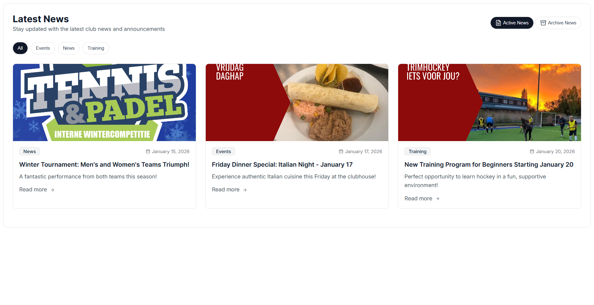
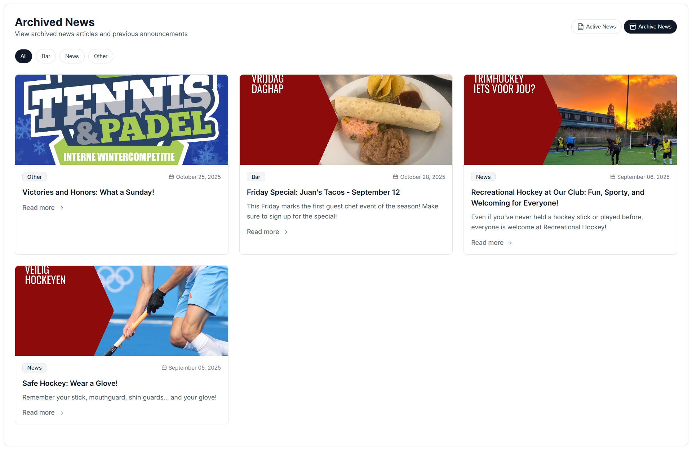

# News Widget

A comprehensive, interactive News widget built with vanilla JavaScript. This widget provides an elegant way to display and manage news articles with filtering capabilities, search functionality, and customizable display settings.

## Screenshots

### Active News



### Archived News



## Overview

The News Widget is designed to help users easily browse and stay updated with club news and announcements. It features:

- **Dual State Display**: Switch between Active and Archived news
- **Advanced Filtering**: Filter news by category
- **Search Functionality**: Real-time search through news titles and descriptions
- **Featured Items**: Configurable featured news display
- **Mobile Optimization**: Responsive design with mobile-specific features
- **Date Filtering**: Automatic filtering based on active/archived status
- **Customizable Display**: Extensive configuration options for UI visibility and behavior

## Features

### News Display

- **Active News**: Currently relevant news items with automatic date-based filtering
- **Archived News**: Historical news items for reference and browsing
- **Featured Items**: Highlight important news at the top of lists
- **Rich Content**: Support for HTML content in news descriptions
- **News Cards**: Beautiful card layout with images, titles, descriptions, and categories
- **Date Display**: Calendar icons with formatted dates (customizable format)
- **Read More Button**: Quick navigation to full news articles

### Filtering & Search

- **Category Filtering**: Filter news by one or multiple categories
- **Active/Archive Toggle**: Seamlessly switch between active and archived news
- **Search Bar**: Real-time search across news titles and introtext
- **Clear Search**: Easy search reset functionality

### Mobile Features

- **Responsive Dropdown**: Mobile-friendly category selector
- **Optimized Cards**: Shortened date format and responsive layout
- **Touch-friendly**: Optimized controls for mobile devices

### Customization Options

- Hide/show widget title
- Hide/show widget subtitle
- Hide/show search bar
- Hide/show category filters
- Hide/show widget outer lines
- Hide/show view all button
- Dark mode support (via CSS)
- Configure featured items display
- Control total news limit
- Configure items per page

## Folder Structure

```
js-news-widget/
├── index.html          # Main HTML structure and layout
├── main.js             # JavaScript logic and functionality (916 lines)
├── style.css           # CSS styling and responsive design
├── dummyData.js        # Sample data structure and configuration
├── screenshots/        # Widget screenshots
│   ├── active-news.png
│   └── archived-news.png
└── README.md           # This documentation file
```

### File Descriptions

#### `index.html`

The main HTML file containing:

- Widget container structure
- Header with title and subtitle
- Active/Archive toggle buttons
- Search bar
- Category filter buttons (desktop) and dropdown (mobile)
- News grid container
- View all button
- No results template

#### `main.js` (916 lines)

Core JavaScript functionality including:

- **Event Listeners**: Search, filtering, pagination, and state management
- **Fetch News**: Load and initialize news data
- **Date Filtering**: Filter news by active/archived status based on dates
- **Category Management**: Dynamic category rendering for buttons and dropdowns
- **News Rendering**: Convert news data to DOM elements with proper formatting
- **Pagination**: Handle view all/show less functionality
- **Search**: Real-time search through news content
- **UI Management**: Handle visibility and display of widget elements

Key Functions:

- `fetchNews()` - Load news data from configuration
- `renderNewsToDom()` - Convert news items to DOM elements
- `handleNewsPagination()` - Manage news display pagination
- `createCategoriesButtons()` - Generate category filter buttons
- `createCategoriesInDropdown()` - Generate mobile category dropdown
- `filterNewsByDate()` - Filter news based on date and status
- `formatDate()` - Format dates in English locale
- `showNoResults()` - Display no results message

#### `style.css`

Comprehensive styling including:

- Responsive grid layout for news cards
- Desktop and mobile breakpoints
- Category button styling (active/inactive states)
- Search bar styling
- News card design with images and content
- Featured item styling
- Dark mode compatible colors
- Smooth transitions and hover effects

#### `dummyData.js`

Configuration and sample data containing:

- **News Items**: Array of news articles with full details

  - Title, message, introtext
  - Date and time information
  - Author, category, status
  - Images and links
  - Featured flag and archive flag

- **Configuration Options**:
  - Display settings (titles, subtitles, search, categories)
  - Pagination settings (items per page, total limit)
  - Featured items configuration
  - Widget labels and descriptions
  - Device type (desktop/mobile)

## Configuration

The widget can be configured through the `dummyData.js` file:

```javascript
config: {
  // *** DISPLAY SETTINGS ***
  hide_widget_title: false,
  hide_widget_subtitle: false,
  hide_widget_outer_lines: false,
  hide_categories: false,
  show_header_buttons: true,
  show_search_bar: false,

  // *** PAGINATION & LIMITS ***
  total_news_limit: 7,
  news_items_to_show_with_view_all_button: 6,
  hide_all_news_bottom_button: false,

  // *** FEATURED ITEMS ***
  no_of_featured_items_on_mobile: 1, // 0, 'all', or number

  // *** ASSETS & IMAGES ***
  news_placeholder_image: "https://...",

  // *** ACTIVE NEWS LABELS ***
  active_widget_title: "Latest News",
  active_widget_subtitle: "Stay updated with the latest club news and announcements",

  // *** ARCHIVED NEWS LABELS ***
  archived_widget_title: "Archived News",
  archived_widget_subtitle: "View archived news articles and previous announcements"
}
```

### Configuration Details

- **hide_widget_title**: Set to `true` to hide the main heading
- **hide_widget_subtitle**: Set to `true` to hide the subtitle/description
- **hide_categories**: Set to `true` to hide all category filters
- **show_header_buttons**: Set to `false` to hide Active/Archive buttons (shows only active news)
- **show_search_bar**: Set to `true` to display search functionality
- **total_news_limit**: Maximum number of news items to load from data
- **news_items_to_show_with_view_all_button**: Items shown before "View all" button appears
- **no_of_featured_items_on_mobile**: Set to `0` (none), `'all'` (all featured), or a number
- **news_placeholder_image**: Default image if news item has no image

## Data Structure

Each news item in `listNews` array should contain:

```javascript
{
  lnkWebsite: "/news-detail/123456",      // Link to full news article
  title: "News Title",
  message: "<p>Full HTML content...</p>", // Full article content
  introtext: "Short description",          // Snippet shown in list
  categories: "News",                      // Category for filtering
  featured: true,                          // Whether to feature this item
  is_archived: false,                      // Active (false) or archived (true)

  // Date/Time Information
  starts_at_date: "15-01-2026",           // DD-MM-YYYY format
  starts_at_time: "14:20",                // HH:MM format
  ends_at_date: "20-01-2026",             // Display until this date
  ends_at_time: "14:20",

  // Metadata
  author: "John Smith",
  id: "750001",
  is_pinned: true,
  homepage_image: "https://image-url.jpg",
  inserted_at_date: "15-01-2026",
  updated_at_date: "15-01-2026"
}
```

## Usage

### Basic Setup

1. Include the widget files in your HTML:

```html
<link rel="stylesheet" href="path/to/style.css" />
<script type="module" src="path/to/main.js"></script>
```

2. Create the widget container structure (see `index.html`)

3. Customize `dummyData.js` with your news content and preferences

### Running Locally

```bash
# Using Python 3
python -m http.server 8000
# Navigate to http://localhost:8000/widgets/js-news-widget/

# Using Python 2
python -m SimpleHTTPServer 8000

# Using Node.js (with http-server)
npx http-server
# Navigate to http://localhost:8080/widgets/js-news-widget/
```

## Technical Details

- **Vanilla JavaScript** (ES6+ modules)
- **No external dependencies** (pure JavaScript)
- **CSS Grid & Flexbox** for layout
- **Responsive Design** with mobile-first approach
- **Dynamic DOM manipulation** for real-time filtering and search
- **Date-based filtering** for active/archived status
- **Optional chaining** for safe DOM queries

## Browser Support

- Chrome/Edge (Latest)
- Firefox (Latest)
- Safari (Latest)
- Mobile browsers (iOS Safari, Chrome Mobile)

## Accessibility

- Semantic HTML structure
- Aria labels for icon buttons
- Keyboard navigation support
- Color contrast compliant
- Screen reader friendly

## Performance Considerations

- Efficient DOM updates (batch operations)
- Minimal reflow/repaint
- Lazy loading optimizations
- Optimized event listeners
- CSS animations for smooth transitions

## Customization Examples

### Show Only Active News (No Archive Toggle)

```javascript
show_header_buttons: false,
```

### Display All News Without "View All" Button

```javascript
hide_all_news_bottom_button: true,
```

### Feature All News Items

```javascript
no_of_featured_items_on_mobile: 'all',
```

### Hide All UI Elements

```javascript
hide_widget_title: true,
hide_widget_subtitle: true,
hide_categories: true,
show_search_bar: false,
```

## License

This widget is part of the vanilla-javascript-widgets collection.

## Support

For issues, feature requests, or questions, please refer to the main project repository.
