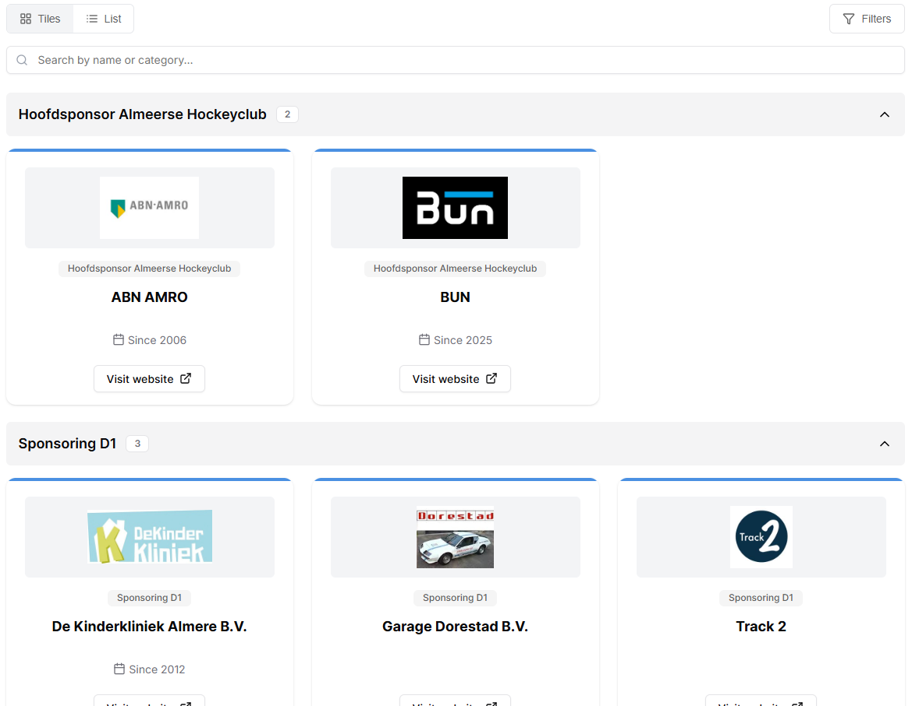
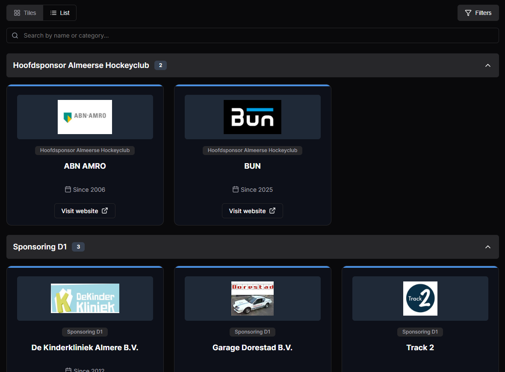

# Sponsors Widget

A comprehensive, interactive Sponsors Directory widget built with vanilla JavaScript. This widget provides an elegant way to display and manage sponsors with multiple viewing options, filtering capabilities, and customizable display settings.

## Screenshots

### Light Mode



### Dark Mode



## Overview

The Sponsors Widget is designed to help users easily browse and discover sponsors. It features:

- **Dual View Modes**: Switch between Tiles view and List view
- **Category Grouping**: Sponsors are automatically organized by category
- **Advanced Filtering**: Filter sponsors by one or multiple categories
- **Search Functionality**: Real-time search by sponsor name, description, or category
- **Expandable Accordions**: Click to expand/collapse sponsor categories
- **Responsive Design**: Optimized for desktop and mobile devices
- **Customizable Display**: Configurable options for dark mode and UI visibility

## Features

### View Modes

- **Tiles View**: Grid-based card layout displaying sponsor logo, name, category, description, and website link
- **List View**: Compact list layout suitable for content-rich sponsor descriptions

### Filtering & Search

- **Category Filtering**: Filter sponsors by one or multiple categories
- **Search Bar**: Real-time search across sponsor name, description, and category
- **Clear All**: Reset all filters with a single click

### Sponsor Display

- **Category Accordions**: Collapsible category sections showing sponsor count
- **Alphabetical Sorting**: Sponsors sorted alphabetically within categories
- **Rich Content**: Support for HTML content in sponsor descriptions
- **External Links**: Optional “Visit website” button per sponsor

### Customization Options

- Dark mode support
- Hide/show search bar
- Hide/show filter button
- Hide/show view toggle buttons
- Hide/show sponsor logo
- Hide/show sponsor name
- Hide/show sponsor category
- Hide/show sponsor description
- Hide/show sponsor “since” year
- Default view mode (desktop/mobile)

## Folder Structure

js-sponsors-widget/
├── index.html
├── main.js
├── style.css
├── dummyData.js
├── screenshots/
│ ├── sponsors-widget.png
│ └── sponsors-widget-dark-mode.png
└── README.md

### File Descriptions

#### `index.html`

The main HTML file containing:

- Widget container structure
- Header with view toggle buttons (Tiles/List)
- Filter dropdown with category checkboxes
- Search bar input
- Tiles view container
- List view container
- No results message container
- Loader and empty-state handling

#### `main.js`

The core JavaScript file containing:

- **Data Management**: Sponsor data processing and category grouping
- **View Toggle**: Switching between Tiles and List views
- **Filter System**: Category-based filtering logic
- **Search Functionality**: Real-time search implementation
- **Rendering Functions**: Dynamic DOM generation for both views
- **Accordion Logic**: Expand/collapse category sections
- **Responsive Handling**: Grid adjustment based on container width
- **Configuration Handling**: CMS-driven widget configuration options
- **Helper Functions**: SVG generation, sorting, utility methods

#### `style.css`

Comprehensive styling file including:

- CSS custom properties (variables)
- Responsive grid layouts
- Accordion animations and transitions
- Dark mode styles
- Button, input, and card styling
- Responsive breakpoints (mobile, tablet, desktop)

#### `dummyData.js`

Sample data structure showing:

- Sponsor items with all supported properties
- Configuration options
- Category examples
- Device detection
- Edge cases (missing images, URLs, categories)

## Data Structure

The widget expects data in the following format:

```javascript
export const sponsors = [
  {
    id: "uuid",
    name: "Sponsor Name",
    image_url: "https://...",
    url: "https://...",
    description: "<p>HTML content...</p>",
    categories: ["Category Name"],
    sponsor_since: "2006-10-06T00:00:00Z",
  },
];

export const data = {
  config: {
    dark_mode: false,
    show_sponsors: "with_categories" | "without_categories",
    default_view_on_desktop: "tiles" | "list",
    default_view_on_mobile: "tiles" | "list",
    hide_view_buttons: false,
    hide_search_bar: false,
    hide_filter_button: false,
    hide_sponsor_logo: false,
    hide_sponsor_name: false,
    hide_sponsor_category: false,
    hide_sponsor_description: true,
    hide_sponsor_since: false,
    default_card_line_color: "#4a90e2",
  },
  device: "desktop" | "mobile",
};
```

## Usage

1. **Include the files** in your HTML:

   ```html
   <link rel="stylesheet" href="style.css" />
   <script src="main.js" type="module"></script>
   ```

2. **Provide data** via `dummyData.js` or your data source:

   ```javascript
   import { data } from "./dummyData.js";
   ```

3. **Initialize the widget** - The widget automatically initializes on page load.

## Configuration Options

| Option                     | Description                                     |
| -------------------------- | ----------------------------------------------- |
| `dark_mode`                | Enable dark mode styling                        |
| `show_sponsors`            | Show sponsors with or without category grouping |
| `default_view_on_desktop`  | Default view for desktop                        |
| `default_view_on_mobile`   | Default view for mobile                         |
| `hide_view_buttons`        | Hide Tiles/List toggle buttons                  |
| `hide_search_bar`          | Hide the search input field                     |
| `hide_filter_button`       | Hide category filter dropdown                   |
| `hide_sponsor_logo`        | Hide sponsor logo                               |
| `hide_sponsor_name`        | Hide sponsor name                               |
| `hide_sponsor_category`    | Hide sponsor category                           |
| `hide_sponsor_description` | Hide sponsor description                        |
| `hide_sponsor_since`       | Hide sponsor “since” year                       |

## Browser Support

- Modern browsers (Chrome, Firefox, Safari, Edge)
- ES6+ JavaScript features required
- CSS Grid and Flexbox support needed

## Dependencies

- **Google Fonts**: Inter font family (loaded via CDN)
- **No external JavaScript libraries** required (vanilla JS)

## Notes

- The widget uses ES6 modules (`type="module"`)
- SVG icons are generated dynamically via JavaScript
- All styling is scoped to `.lx-sponsors-wrap ` to prevent conflicts
- Pure vanilla JavaScript implementation - no frameworks or external dependencies required
